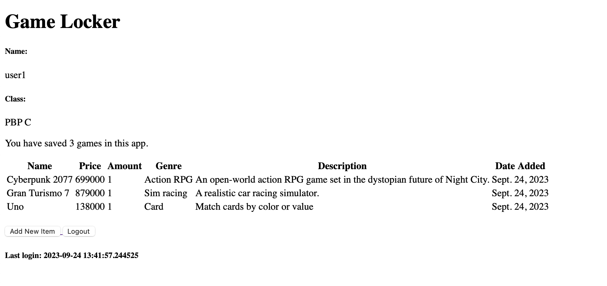
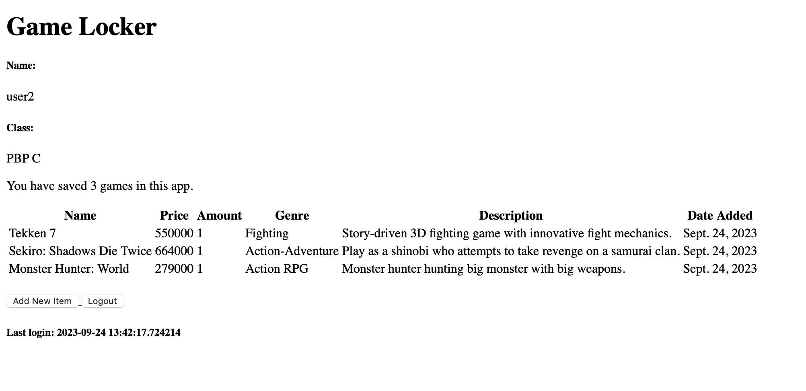

# Game Locker 🎮
#### Tautan aplikasi: https://game-locker.adaptable.app/main/

## Section
- [Tugas 2](#tugas-2-implementasi-model-view-template-mvt-pada-django)
    - [Pertanyaan 1: Implementasi](#jelaskan-bagaimana-cara-kamu-mengimplementasikan-checklist-di-atas-secara-step-by-step-bukan-hanya-sekadar-mengikuti-tutorial)
    - [Pertanyaan 2: Bagan Django](#buatlah-bagan-yang-berisi-request-client-ke-web-aplikasi-berbasis-django-beserta-responnya-dan-jelaskan-pada-bagan-tersebut-kaitan-antara-urlspy-viewspy-modelspy-dan-berkas-html)
    - [Pertanyaan 3: Mengapa menggunakan *virtual environment*](#jelaskan-mengapa-kita-menggunakan-virtual-environment-apakah-kita-tetap-dapat-membuat-aplikasi-web-berbasis-django-tanpa-menggunakan-virtual-environment)
    - [Pertanyaan 4: Penjelasan dan perbedaan MVC, MVT, MVVM](#jelaskan-apakah-itu-mvc-mvt-mvvm-dan-perbedaan-dari-ketiganya)
- [Tugas 3](#tugas-3-implementasi-form-dan-data-delivery-pada-django)
    - [Pertanyaan 1: Perbedaan form POST dan form GET](#apa-perbedaan-antara-form-post-dan-form-get-dalam-django)
    - [Pertanyaan 2: Perbedaan XML, JSON dan HTML dalam pengiriman data](#apa-perbedaan-utama-antara-xml-json-dan-html-dalam-konteks-pengiriman-data)
    - [Pertanyaan 3: Mengapa JSON sering digunakan dalam pertukaran data](#mengapa-json-sering-digunakan-dalam-pertukaran-data-antara-aplikasi-web-modern)
    - [Pertanyaan 4: Implementasi](#jelaskan-bagaimana-cara-kamu-mengimplementasikan-checklist-di-atas-secara-step-by-step-bukan-hanya-sekadar-mengikuti-tutorial-1)
    - [Pertanyaan 5: Mengakses kelima URL dengan Postman](#mengakses-kelima-url-menggunakan-postman)
- [Tugas 4](#tugas-4-implementasi-autentikasi-session-dan-cookies-pada-django)
    - [Pertanyaan 1: Apa itu Django `UserCreationForm`](#apa-itu-django-usercreationform-dan-jelaskan-apa-kelebihan-dan-kekurangannya)
    - [Pertanyaan 2: Perbedaan autentikasi dan otorisasi dalam Django](#apa-perbedaan-antara-autentikasi-dan-otorisasi-dalam-konteks-django-dan-mengapa-keduanya-penting)
    - [Pertanyaan 3: Apa itu *cookies* dan bagaimana Django menggunakannya](#apa-itu-cookies-dalam-konteks-aplikasi-web-dan-bagaimana-django-menggunakan-cookies-untuk-mengelola-data-sesi-pengguna)
    - [Pertanyaan 4: Apakah penggunaan *cookies* aman secara *default*](#apakah-penggunaan-cookies-aman-secara-default-dalam-pengembangan-web-atau-apakah-ada-risiko-potensial-yang-harus-diwaspadai)
    - [Pertanyaan 5: Implementasi](#jelaskan-bagaimana-cara-kamu-mengimplementasikan-checklist-di-atas-secara-step-by-step-bukan-hanya-sekadar-mengikuti-tutorial-2)
- [Tugas 5]()
    - [Pertanyaan 1: Perbedaan form POST dan form GET](#apa-perbedaan-antara-form-post-dan-form-get-dalam-django)
    - [Pertanyaan 2: Perbedaan XML, JSON dan HTML dalam pengiriman data](#apa-perbedaan-utama-antara-xml-json-dan-html-dalam-konteks-pengiriman-data)
    - [Pertanyaan 3: Mengapa JSON sering digunakan dalam pertukaran data](#mengapa-json-sering-digunakan-dalam-pertukaran-data-antara-aplikasi-web-modern)
    - [Pertanyaan 4: Implementasi](#jelaskan-bagaimana-cara-kamu-mengimplementasikan-checklist-di-atas-secara-step-by-step-bukan-hanya-sekadar-mengikuti-tutorial-1)
    - [Pertanyaan 5: Mengakses kelima URL dengan Postman](#mengakses-kelima-url-menggunakan-postman)
## Tugas 2: Implementasi *Model-View-Template* (MVT) pada Django
### Jelaskan bagaimana cara kamu mengimplementasikan *checklist* di atas secara step-by-step (bukan hanya sekadar mengikuti tutorial).
### Checklist 1: Membuat sebuah proyek Django baru
1. Membuat direktori baru untuk proyek ini dengan nama `game_locker`.
1. Membuka terminal dan pindah ke direktori tersebut.
1. Membuat berkas `requirements.txt` yang berisikan beberapa *dependencies* sebagai berikut.
    ```
    django
    gunicorn
    whitenoise
    psycopg2-binary
    requests
    urllib3
    ```
1. Membuat *virtual environment* dengan menjalankan perintah `python -m venv env`
1. Mengaktifkan *virtual environment* dengan perintah `source env/bin/activate`
1. Menginstalasi *dependencies* di atas dengan perintah `pip install -r requirements.txt`
1. Membuat projek Django baru dengan nama `game_locker` melalui perintah `django-admin startproject game_locker .`
1. Menambahkan `*` pada `ALLOWED_HOSTS` di `settings.py` untuk keperluan deployment.
    ```
    ...
    ALLOWED_HOSTS = ["*"]
    ...
    ```
1. Tambahkan juga berkas `.gitignore` sebelum melakukn *add*, *commit*, dan *push*. Untuk berkas `.gitignore` yang digunakan dalam proyek ini mengikuti template [berikut](https://pbp-fasilkom-ui.github.io/ganjil-2024/docs/tutorial-0#tutorial-unggah-proyek-ke-repositori-github).

### Checklist 2: Membuat aplikasi `main` pada proyek tersebut
1. Menjalankan perintah ini untuk membuat aplikasi baru bernama main `main`:
    ```
    python manage.py startapp main
    ```
1. Tambahkan aplikasi main ke dalam proyek:
    - Buka berkas `settings.py` di dalam direktori proyek `game_locker`.
    - Temukan variabel `INSTALLED_APPS`.
    - Daftarkan `main` ke dalam daftar aplikasi yang ada:
        ```
        INSTALLED_APPS = [
            ...,
            'main',
            ...
        ]
        ```

### Checklist 3: Melakukan *routing* pada proyek agar dapat menjalankan aplikasi `main`
#### * Dilakukan nanti bersamaan dengan *routing* pada `urls.py` aplikasi `main`.
1. Bukalah berkas `urls.py` di dalam direktori `game_locker` dan isi berkas dengan kode berikut.
    ```
    ...
    from django.urls import path, include

    urlpatterns = [
        ...
        path('main/', include('main.urls')),
        ...
    ]
    ```

### Checklist 4: Membuat model pada aplikasi `main` dengan nama *Item* dan memiliki atribut wajib *name*, *amount*, *description*
1. Membuka berkas `models.py` di dalam direktori `main`.
1. Mengisi `models.py` dengan kode berikut.
    ```
    from django.db import models

    class Item(models.Model):
        name = models.CharField(max_length=255) 
        amount = models.IntegerField()
        description = models.TextField()
        price = models.IntegerField()
        genre = models.CharField(max_length=30)
        date_added = models.DateField(auto_now_add=True)
    ```
1. Menjalankan perintah `python manage.py makemigrations` untuk membuat migrasi model. Berkas migrasi yang berisi perubahan model belum diaplikasikan ke dalam basis data.
1. Menjalankan perintah `python manage.py migrate` untuk menerapkan migrasi ke dalam basis data lokal.

### Checklist 5: Membuat sebuah fungsi pada views.py untuk dikembalikan ke dalam sebuah template HTML yang menampilkan nama aplikasi serta nama dan kelas kamu
1. Membuat direktori bernama `templates` di dalam direktori `main`
1. Membuat berkas `main.html` di dalam direktori `templates` dan diisi dengan teks berikut.
    ```
    <h1>Game Locker</h1>
    <p>Name: {{ name }}</p>
    <p>Class: {{ class }}</p>
    ```
1. Membuka berkas `views.py` di dalam direktori `main` dan isi dengan kode berikut.
    ```
    from django.shortcuts import render

    def show_main(request):
        context = {
            'name': 'Fikri Risyad Indratno',
            'class': 'PBP C'
        }
    
        return render(request, "main.html", context)
    ```

### Checklist 6: Membuat sebuah *routing* pada `urls.py` aplikasi `main` untuk memetakan fungsi yang telah dibuat pada `views.py`.
1. Membuat berkas `urls.py` di dalam direktori `main`.
2. Mengisi `urls.py` dengan kode berikut.
    ```
    from django.urls import path
    from main.views import show_main

    app_name = 'main'

    urlpatterns = [
        path('', show_main, name='show_main'),
    ]
    ```
### Checklist 7: Melakukan deployment ke Adaptable terhadap aplikasi yang sudah dibuat
1. *Login* ke Adaptable menggunakan akun GitHub.
1. Klik `New App` dan pilih *Connect an Existing Repository*.
1. Klik repositori proyek ini, yaitu `fikririsyad/game-locker` dan pilih *branch* main.
1. Pilih `Python App Template` sebagai *deploy template*.
1. Pilih `PostgreSQL` sebagai *Database Type*.
1. Pilih versi Python yang dipakai dalam proyek ini, yaitu `3.11` dan masukkan `python manage.py migrate && gunicorn game_locker.wsgi` pada bagian `Start Command`.
1. Masukkan nama aplikasi.
1. Centang bagian `HTTP Listener on PORT` dan klik `Deploy App` untuk memulai proses `deployment` aplikasi.

## Buatlah bagan yang berisi *request client* ke web aplikasi berbasis Django beserta responnya dan jelaskan pada bagan tersebut kaitan antara `urls.py`, `views.py`, `models.py`, dan berkas `html`.

### Penjelasan
1. *User* mengirimkan HTTP *Request* ke aplikasi Django.
2. Oleh `urls.py`, *request* tersebut akan diteruskan ke `views.py` yang sesuai.
3. `views.py` akan menggunakan `models.py` jika perlu mengakses data dari *database*.
4. Setelah selesai memproses *request*, `views.py` akan me-*render* HTML *template*.
5. HTML yang sudah ter-*render* kemudian akan dikembalikan ke *user* sebagai HTTP *response*.

## Jelaskan mengapa kita menggunakan ***virtual environment***? Apakah kita tetap dapat membuat aplikasi web berbasis Django tanpa menggunakan ***virtual environment***?
*Virtual environment* dibutuhkan dalam pembuatan aplikasi web berbasis Django untuk mengisolasi Python dan *dependencies* yang diperlukan. Dengan menggunakan *virtual environment*, Python dan *dependencies* yang kita perlukan tidak tercampur dengan Python dan *packages* dari *base environment*. Kita sebenarnya bisa saja membuat aplikasi web Django tanpa menggunakan *virtual environment*. Akan tetapi, agar lebih mudah mengelola Python dan *dependencies*-nya, lebih baik tetap menggunakan *virtual environment*.

## Jelaskan apakah itu MVC, MVT, MVVM dan perbedaan dari ketiganya.
### Penjelasan
1. MVC atau *Model*-*View*-*Controller*:

    - ***Model***</br>
        Komponen *Model* berfungsi untuk membuat logika data aplikasi dan mengelola datanya. 
    - ***View***</br>
        Komponen *View* berisikan logika dan struktur tampilan data yang akan dilihat.
    - ***Controller***</br>
        Komponen *Controller* berfungsi untuk menangani *request* dan memberikan *response*. *Controller* bertindak sebagai penghubung antara *Model* dan *View*. Menentukan View apa yang akan di-*render*.

1. MVT atau *Model*-*View*-*Template*:

    - ***Model***</br>
        Komponen *Model* berfungsi untuk membuat logika data aplikasi dan mengelola datanya.
    - ***View***</br>
        Komponen *View* berfungsi untuk menangani *request* dan memberikan *response*.
    - ***Template***</br>
        Komponen *Template* mendefinisikan struktur HTML yang nantinya akan di-*render*.

1. MVVM atau *Model*-*View*-*ViewModel*:

    - ***Model***</br>
        Komponen *Model* berfungsi untuk membuat logika data aplikasi dan mengelola datanya.
    - ***View***</br>
        Komponen *View* berkaitan dengan struktur dan tampilan data yang akan dilihat. *View* berinteraksi dengan *ViewModel* melalui *data binding*.
    - ***ViewModel***</br>
        Komponen *ViewModel* bertindak sebagai penghubung antara *Model* dan *View*. *ViewModel* berisikan logika utama bisnis.

### Perbedaan
- Perbedaan utama antara MVC dan MVT adalah pada MVC kita harus membuat semua kode untuk kontrol. Pada MVT, bagian *controller* sudah ditangani oleh *framework*.
- Perbedaan utama antara MVC dan MVVM adalah pada MVVM, *View* dapat berinteraksi langsung dengan propertinya di *ViewModel* menggunakan *data binding*.

## Tugas 3: Implementasi Form dan Data Delivery pada Django
### Apa perbedaan antara form `POST` dan form `GET` dalam Django?
1. `POST`
    - Akan mengumpulkan data dan meng-*encode* data tersebut untuk dikirimkan ke *server*.
    - Lebih aman untuk melindungi data karena tidak akan diekspos di URL.
    - Digunakan untuk *request* yang mengubah keadaan sistem, seperti *request* untuk melakukan perubahan di *database*.
1. `GET`
    - Akan mengumpulkan data menjadi sebuah *string* kemudian *string* tersebut digunakan untuk membuat URL bersama dengan nilai-nilainya.
    - Lebih tidak aman karena akan mengekspos data di URL.
    - Digunakan untuk *request* yang tidak mengubah keadaan sistem, seperti formulir pencarian web.
### Apa perbedaan utama antara XML, JSON, dan HTML dalam konteks pengiriman data?
1. XML
    - Format berkas untuk menyimpan dan mengirim data.
    - Lebih kompleks dan kurang fleksibel.
    - Ukuran berkas lebih besar dari JSON sehingga pengiriman data lebih lambat.
1. JSON
    - Format berkas untuk menyimpan dan mengirim data.
    - Lebih simpel dan lebih fleksibel.
    - Ukuran berkas lebih kecil dari XML sehingga pengiriman data lebih cepat
1. HTML
    - Format berkas untuk membuat struktur dan tampilan konten web.
### Mengapa JSON sering digunakan dalam pertukaran data antara aplikasi web modern?
Alasan utama JSON sering digunakan adalah karena ukuran berkas yang kecil dan pertukaran data yang sangat cepat. Selain itu, JSON memiliki format yang simpel, lebih mudah untuk dibaca, serta lebih mudah untuk di-*parsing* jika dibandingkan dengan XML.

### Jelaskan bagaimana cara kamu mengimplementasikan *checklist* di atas secara *step-by-step* (bukan hanya sekadar mengikuti tutorial).
### Checklist 1: Membuat input `form` untuk menambahkan objek model pada app sebelumnya.
1. Membuat kerangka `views` dengan cara membuat direktori baru bernama `templates` pada direktori *root*.
1. Membuat berkas `base.html` sebagai *template* dasar dan diisi dengan kode berikut:
    ```
    
    <!DOCTYPE html>
    <html lang="en">
        <head>
            <meta charset="UTF-8" />
            <meta
                name="viewport"
                content="width=device-width, initial-scale=1.0"
            />
            
            
        </head>

        <body>
            
            
        </body>
    </html>
    ```
1. Menambahkan kode berikut ke `settings.py` di dalam direktori `game_locker` agar *templates* di atas dapat terdeteksi:
    ```
    ...
    TEMPLATES = [
        {
            'BACKEND': 'django.template.backends.django.DjangoTemplates',
            'DIRS': [BASE_DIR / 'templates'], # Tambahkan kode ini
            'APP_DIRS': True,
            ...
        }
    ]
    ...
    ```
1. Membuat berkas `forms.py` di dalam direktori `main` dan mengisi berkas tersebut dengan kode berikut:
    ```
    from django.forms import ModelForm
    from main.models import Item

    class ItemForm(ModelForm):
        class Meta:
            model = Item
            fields = ["name", "price", "amount", "genre", "description"]
    ``` 
1. Membuka berkas `views.py` pada direktori `main` dan menambahkan fungsi `create_item` untuk menghasilkan formulir.
    ```
    from django.http import HttpResponseRedirect
    from django.urls import reverse
    from main.forms import ItemForm
    ...
    def create_item(request):
    form = ItemForm(request.POST or None)

    if form.is_valid() and request.method == "POST":
        form.save()
        return HttpResponseRedirect(reverse('main:show_main'))

    context = {'form': form}
    return render(request, "create_item.html", context)
    ```
1. Menambahkan *path* URL ke dalam `urls.py` pada direktori `main` dengan kode berikut:
    ```
    from main.views import show_main, create_item
    ...
    urlpatterns = [
        ...
        path('create-item', create_item, name='create_item'),
    ]
    ```
1. Membuat direktori `templates` pada direktori *root* dan menambahkan berkas `base.html` yang akan menjadi *template* HTML untuk berkas HTML lainnya. Isi berkas dengan kode berikut:
    ```
    
    <!DOCTYPE html>
    <html lang="en">
        <head>
            <meta charset="UTF-8" />
            <meta
                name="viewport"
                content="width=device-width, initial-scale=1.0"
            />
            
            
        </head>

        <body>
            
            
        </body>
    </html>
    ```
1. Menambahkan kode berikut di dalam berkas `settings.py` pada direktori `game_locker` agar *templates* di atas dapat terdeteksi.
    ```
    ...
    TEMPLATES = [
        {
            'BACKEND': 'django.template.backends.django.DjangoTemplates',
            'DIRS': [BASE_DIR / 'templates'], # Tambahkan kode ini
            'APP_DIRS': True,
            ...
        }
    ]
    ...
    ```
1. Mengubah berkas `main.html` pada direktori `main/templates` untuk bisa menggunakan *templates* di atas serta untuk menampilkan objek yang nantinya akan di-*submit* melalui formulir.
    ```
    

    
        <h1>Game Locker</h1>

        <h5>Name:</h5>
        <p>{{name}}</p>

        <h5>Class:</h5>
        <p>{{class}}</p>
        <table>
            <tr>
                <th>Name</th>
                <th>Price</th>
                <th>Amount</th>
                <th>Genre</th>
                <th>Description</th>
                <th>Date Added</th>
            </tr>

            
                <tr>
                    <td>{{item.name}}</td>
                    <td>{{item.price}}</td>
                    <td>{{item.amount}}</td>
                    <td>{{item.genre}}</td>
                    <td>{{item.description}}</td>
                    <td>{{item.date_added}}</td>
                </tr>
            
        </table>

        <br />

        <a href="">
            <button>
                Add New Item
            </button>
        </a>
    
    ```
1. Membuat berkas `create_item.html` pada direktori `main/templates` sebagai halaman untuk men-*submit* formulir dengan isi sebagai berikut:
    ```
     

    
    <h1>Add New Item</h1>

    <form method="POST">
        
        <table>
            {{ form.as_table }}
            <tr>
                <td></td>
                <td>
                    <input type="submit" value="Add Item"/>
                </td>
            </tr>
        </table>
    </form>

    
    ```
### Checklist 2: Tambahkan 5 fungsi `views` untuk melihat objek yang sudah ditambahkan dalam format HTML, XML, JSON, XML *by ID*, dan JSON *by ID*.
#### Format HTML
Membuka kembali berkas `views.py` pada direktori `main` dan mengubah fungsi `show_main` menjadi sebagai berikut untuk menampilkan semua objek `Item` pada halaman utama.
```
from main.models import Item
...
def show_main(request):
items = Item.objects.all()

context = {
    'name': 'Fikri Risyad Indratno',
    'class': 'PBP C',
    'items': items
}

return render(request, "main.html", context)
```

#### Format XML
Menambahkan fungsi `show_xml` untuk menampilkan data-data dalam format XML dengan kode berikut:
```
from django.http import HttpResponse
from django.core import serializers
...
def show_xml(request):
data = Item.objects.all()
return HttpResponse(serializers.serialize("xml", data), content_type="application/xml")
```

#### Format JSON
Menambahkan fungsi `show_json` untuk menampilkan data-data dalam format JSON dengan kode berikut:
```
def show_json(request):
data = Item.objects.all()
return HttpResponse(serializers.serialize("json", data), content_type="application/json")
```

#### Format XML *by ID*
Menambahkan fungsi `show_xml_by_id` untuk menampilkan data yang dipilih berdasarkan `id` dalam format XML dengan kode berikut:
```
def show_xml_by_id(request, id):
data = Item.objects.filter(pk=id)
return HttpResponse(serializers.serialize("xml", data), content_type="application/xml")
```

#### Format JSON *by ID*
Menambahkan fungsi `show_json_by_id` untuk menampilkan data yang dipilih berdasarkan `id` dalam format JSON dengan kode berikut:
```
def show_json_by_id(request, id):
data = Item.objects.filter(pk=id)
return HttpResponse(serializers.serialize("json", data), content_type="application/json")
```

### Checklist 3: Membuat routing URL untuk masing-masing `views` yang telah ditambahkan pada poin 2.
Membuka berkas `urls.py` pada direktori `main` dan menambahkan kode berikut:
```
from main.views import show_main, create_item, show_xml, show_json, show_xml_by_id, show_json_by_id
...
urlpatterns = [
    ...
    path('create-item', create_item, name='create_item'),
    path('xml/', show_xml, name='show_xml'), 
    path('json/', show_json, name='show_json'),
    path('xml/<int:id>/', show_xml_by_id, name='show_xml_by_id'),
    path('json/<int:id>/', show_json_by_id, name='show_json_by_id'), 
]
```

### Mengakses kelima URL menggunakan Postman.
#### Format HTML

#### Format XML

#### Format JSON

#### Format XML *by ID*

#### Format JSON *by ID*


## Tugas 4: Implementasi Autentikasi, Session, dan Cookies pada Django
### Apa itu Django `UserCreationForm`, dan jelaskan apa kelebihan dan kekurangannya?
`UserCreationForm` adalah *built-in form* yang disediakan oleh Django untuk membuat *user* baru. Kelebihannya, kita tidak perlu susah-susah membuat formulir karena dengan menggunakan `UserCreationForm`, sudah disediakan tempat untuk mengisi *username* dan *password* serta beberapa syarat agar *password* tersebut valid. Kekurangannya, mungkin tampilan yang diberikan tidak sesuai dengan keinginan kita dan `UserCreationForm` hanya mempunyai *field* *username* dan *password* sehingga harus menambahkan kode lagi.
### Apa perbedaan antara autentikasi dan otorisasi dalam konteks Django, dan mengapa keduanya penting?
Autentikasi adalah proses untuk memverifikasi identitas pengguna yang sedang mengunjungi aplikasi Django melalui tahapan *login*. Otorisasi adalah proses untuk memverifikasi bahwa apakah pengguna mempunyai hak untuk mengakses misalnya data atau suatu halaman di aplikasi Django. Keduanya penting sebagai menjaga keamanan sistem aplikasi Django. Sehingga tidak semua orang bisa sembarang masuk ke aplikasi Django dan mengambil atau mengubah data yang ada.
### Apa itu *cookies* dalam konteks aplikasi web, dan bagaimana Django menggunakan *cookies* untuk mengelola data sesi pengguna?
*Cookies* adalah sebuah berkas yang menyimpan data unik untuk mengidentifikasi komputer kita ke internet. Ketika kita pengguna membuka dan masuk ke aplikasi, Django akan membuat *cookies* yang nantinya akan disimpan di dalam memori *browser*. *Cookies* akan dihapus ketika pengguna *logout* dari aplikasi atau *browser* ditutup.
### Apakah penggunaan *cookies* aman secara *default* dalam pengembangan web, atau apakah ada risiko potensial yang harus diwaspadai?
*Cookies* yang diberikan oleh *website* tepercaya secara umum seharusnya aman untuk digunakan. Akan tetapi, masih ada risiko yang harus diwaspadai seperti *cookies poisoing* di mana penyerang akan memanipulasi *cookies* untuk mendapatkan akses ke akun pengguna dan mencuri informasi sensitif.
### Jelaskan bagaimana cara kamu mengimplementasikan *checklist* di atas secara step-by-step (bukan hanya sekadar mengikuti tutorial).
### Checklist 1: Mengimplementasikan fungsi registrasi, login, dan logout untuk memungkinkan pengguna untuk mengakses aplikasi sebelumnya dengan lancar.
1. Membuka `views.py` pada direktori `main` dan menambahkan kode di untuk membuat fungsi `register`:
    ```
    from django.shortcuts import redirect
    from django.contrib.auth.forms import UserCreationForm
    from django.contrib import messages
    ...
    def register(request):
        form = UserCreationForm()

        if request.method == "POST":
            form = UserCreationForm(request.POST)
            if form.is_valid():
                form.save()
                messages.success(request, 'Your account has been successfully created!')
                return redirect('main:login')
        context = {'form':form}
        return render(request, 'register.html', context)
    ```
1. Membuat fungsi `login_user` dan menambahkan kode berikut untuk mengautentikasi pengguna yang ingin *login*. Kode ini juga sudah menambahkan *cookie* bernama `last_login` untuk melihat kapan terakhir kali *login*.
    ```
    import datetime
    from django.contrib.auth import authenticate, login
    ...
    def login_user(request):
        if request.method == 'POST':
            username = request.POST.get('username')
            password = request.POST.get('password')
            user = authenticate(request, username=username, password=password)
            if user is not None:
                login(request, user)
                response = HttpResponseRedirect(reverse("main:show_main")) 
                response.set_cookie('last_login', str(datetime.datetime.now()))
                return response
            else:
                messages.info(request, 'Sorry, incorrect username or password. Please try again.')
        context = {}
        return render(request, 'login.html', context)
    ```
1. Menambahkan fungsi `logout_user` untuk melakukan mekanisme *logout*:
    ```
    from django.contrib.auth import logout
    ...
    def logout_user(request):
        logout(request)
        response = HttpResponseRedirect(reverse('main:login'))
        response.delete_cookie('last_login')
        return response
    ```
1. Menambahkan kode berikut di atas fungsi `show_main` agar pengguna hanya bisa mengakses halaman *main* setelah melakukan *login*.
    ```
    from django.contrib.auth.decorators import login_required
    ...
    @login_required(login_url='/login')
    def show_main(request):
    ...
    ```
1. Membuat berkas `register.html` pada direktori `main/templates` sebagai halaman di mana pengguna bisa melakukan registrasi dan menambahkan kode berikut:
    ```
    

    
        <title>Register</title>
    

      

    <div class = "login">
        
        <h1>Register</h1>  

            <form method="POST" >  
                  
                <table>  
                    {{ form.as_table }}  
                    <tr>  
                        <td></td>
                        <td><input type="submit" name="submit" value="Daftar"/></td>  
                    </tr>  
                </table>  
            </form>

          
            <ul>   
                  
                    <li>{{ message }}</li>  
                      
            </ul>   
        

    </div>  

    
    ```
1. Membuat berkas `login.html` pada direktori `main/templates` sebagai halaman di mana pengguna bisa melakukan *login* dan menambahkan kode berikut:
    ```
    

    
        <title>Login</title>
    

    

    <div class = "login">

        <h1>Login</h1>

        <form method="POST" action="">
            
            <table>
                <tr>
                    <td>Username: </td>
                    <td><input type="text" name="username" placeholder="Username" class="form-control"></td>
                </tr>
                        
                <tr>
                    <td>Password: </td>
                    <td><input type="password" name="password" placeholder="Password" class="form-control"></td>
                </tr>

                <tr>
                    <td></td>
                    <td><input class="btn login_btn" type="submit" value="Login"></td>
                </tr>
            </table>
        </form>

        
            <ul>
                
                    <li>{{ message }}</li>
                
            </ul>
             
            
        Don't have an account yet? <a href="">Register Now</a>

    </div>

    
    ```
1. Membuka berkas `main.html` dan menambahkan kode di bawah ini setelah *hyperlink tag* *Add New Item* untuk membuat tombol *logout*.
    ```
    ...
    <a href="">
        <button>
            Logout
        </button>
    </a>
    ...
    ```
1. Membuka berkas `urls.py` pada direktori `main` dan menambahkan kode berikut untuk menambahkan *path* ke dalam `url_patterns` agar bisa mengakses semua fungsi *views* yang sudah dibuat.
    ```
    from main.views import register, login_user, logout_user
    ...
    urlpatterns = [
        ...
        path('register/', register, name='register'),
        path('login/', login_user, name='login'),
        path('logout/', logout_user, name='logout'),
        ...
    ]
    ```
### Checklist 2: Membuat **dua** akun pengguna dengan masing-masing **tiga** dummy data menggunakan model yang telah dibuat pada aplikasi sebelumnya untuk setiap akun **di lokal**.
#### *Dummy User* 1

#### *Dummy User* 2

### Checklist 3: Menghubungkan model Item dengan User.
1. Membuka `models.py` pada direktori `main` dan tambahkan kode berikut untuk menghubungkan satu *item* dengan satu pengguna.
    ```
    from django.contrib.auth.models import User
    ...
    class Item(models.Model):
        user = models.ForeignKey(User, on_delete=models.CASCADE)
    ...
    ```
1. Membuka `views.py` pada direktori `main` dan menambahkan kode berikut di dalam `create_item`.
    ```
    ...
    if form.is_valid() and request.method == "POST":
        item = form.save(commit=False)
        item.user = request.user
        item.save()
        return HttpResponseRedirect(reverse('main:show_main'))
    ...
    ```
1. Mengubah `show_main` menjadi sebagai berikut untuk menampilkan *item* dan nama pengguna:
    ```
    def show_main(request):
        items = Item.objects.filter(user=request.user)

        context = {
            'name': request.user.username,
        ...
        }
    ```
1. Menyimpan semua perubahan dan menjalankan perintah `python manage.py makemigrations`.
1. Ketika muncul eror, pilih angka 1 untuk menetapkan nilai *default* di *field user* pada semua baris yang telah dibuat pada basis data.
1. Ketik angka 1 untuk menetapkan *user* dengan ID 1 pada model yang sudah ada.
1. Menjalankan perintah `python manage.py migrate` untuk menerapkan migrasi terbaru.
### Checklist 4: Menampilkan detail informasi pengguna yang sedang logged in seperti username dan menerapkan `cookies` seperti `last login` pada halaman utama aplikasi.
1. Membuka berkas `views.py` dan menambahkan kode berikut pada `context` di dalam fungsi `show_main`.
    ```
    context = {
        ...
        'last_login': request.COOKIES['last_login'],
    }
    ```
1. Membuka berkas `main.html` dan menambahkan kode berikut di bawah tombol *logout* untuk menampilkan `last login` pada halaman utama aplikasi.
    ```
    ...
    <h5>Last login: {{ last_login }}</h5>
    ...
    ```

## Tugas 5: Desain Web menggunakan HTML, CSS dan Framework CSS
### Jelaskan manfaat dari setiap *element selector* dan kapan waktu yang tepat untuk menggunakannya.
1. Universal selector</br>
    Untuk memilih semua elemen pada HTML. Digunakan ketika ingin menerapkan gaya pada semua elemen.
1. Element selector</br>
    Untuk memilih semua elemen yang mempunyai nama elemen/*tag* yang sama. Digunakan ketika ingin menerapkan gaya pada suatu *tag* di semua berkas HTML.
1. Class selector</br>
    Untuk memilih semua konten yang memiliki value *class* yang sama. Digunakan ketika ingin menerapkan gaya pada semua elemen yang bisa saja mempunyai *tag* berbeda tetapi menerapkan *class* yang sama.
1. Id selector</br>
    Untuk memilih spesifik satu elemen yang mempunyai id yang sama, karena pada HTML semua id itu unik. Digunakan ketika ingin menerapkan gaya pada spesifik satu elemen itu saja.
### Jelaskan HTML5 Tag yang kamu ketahui.
1. a -> Mendefinisikan *hyperlink*
1. body -> Mendefinisikan bagian *body* dari suatu berkas HTML yang berisikan konten utama dari suatu *webpage*
1. br -> Membuat satu *line break*
1. div -> Mendefinisikan suatu divisi atau bagian
1. form -> Mendefinisikan form
1. h1-h6 -> Mendefinisikan heading
1. head -> Mendefinisikan bagian *head* dari suatu berkas HTML yang biasanya berisikan judul dan *metadata*
1. html -> Menandakan awal dan akhir berkas HTML
1. img -> Merepresentasikan gambar
1. li -> Mendefinisikan *item* dari *list*
1. link -> Menghubungkan berkas dari luar ke dalam berkas HTML
1. ol -> Mendefinisikan *ordered list*
1. ul -> Mendefinisikan *unordered list*
1. p -> Mendefinisikan paragraf
1. table -> Mendefinisikan tabel
1. td -> Mendefinisikan sel tabel
1. th -> Mendefinisikan *header* tabel
1. tr -> Mendefinisikan baris tabel
### Jelaskan perbedaan antara *margin* dan *padding*.
#### Margin
- Daerah atau kotak di luar konten elemen dan *border*.
- Digunakan untuk mengatur jarak suatu elemen dengan elemen lainnya agar tidak bertabrakan.
#### Padding
- Daerah atau kotak di antara konten elemen dan *border*.
- Digunakan untuk mengatur agar konten elemen tidak terlalu dekat dengan border.
### Jelaskan perbedaan antara *framework* CSS Tailwind dan Bootstrap. Kapan sebaiknya kita menggunakan Bootstrap daripada Tailwind, dan sebaliknya?
#### Tailwind
- *Utility-first framework*, belum mempunyai komponen *premade* atau siap pakai.
- Memiliki ukuran berkas CSS yang lebih kecil.
- Lebih sulit untuk dipelajari karena harus mempelajari kelas utilitas yang ada.
#### Bootstrap
- *Components-based framework*, mempunyai komponen *premade* atau siap pakai.
- Memiliki ukuran berkas CSS yang lebih besar.
- Lebih mudah karena dapat langsung menggunakan komponen yang sudah tersedia.
### Jelaskan bagaimana cara kamu mengimplementasikan *checklist* di atas secara *step-by-step* (bukan hanya sekadar mengikuti tutorial).
1. Membuat direktori `static` di direktori `root` dan menambahkan `styles.css` di dalamnya.
1. Menambahkan kode ini di dalam `settings.py` agar berkas CSS dapat ditemukan oleh Django:
    ```
    ...
    import os
    ...
    STATICFILES_DIRS = [os.path.join(BASE_DIR, 'static')]
    ```
1. Menambahkan kode berikut di dalam `base.html` untuk menghubungkan berkas `styles.css` ke berkas ini serta memasukkan Bootstrap CSS dan JS:
    ```
    
    ...
    <head>
        ...
        <link href="https://cdn.jsdelivr.net/npm/bootstrap@5.3.2/dist/css/bootstrap.min.css" rel="stylesheet" integrity="sha384-T3c6CoIi6uLrA9TneNEoa7RxnatzjcDSCmG1MXxSR1GAsXEV/Dwwykc2MPK8M2HN" crossorigin="anonymous">
        <link rel="stylesheet" href="">
    </head>
    <body>
        ...
        <script src="https://cdn.jsdelivr.net/npm/bootstrap@5.3.2/dist/js/bootstrap.bundle.min.js" integrity="sha384-C6RzsynM9kWDrMNeT87bh95OGNyZPhcTNXj1NW7RuBCsyN/o0jlpcV8Qyq46cDfL" crossorigin="anonymous"></script>
        <script src="https://cdn.jsdelivr.net/npm/@popperjs/core@2.11.8/dist/umd/popper.min.js" integrity="sha384-I7E8VVD/ismYTF4hNIPjVp/Zjvgyol6VFvRkX/vR+Vc4jQkC+hVqc2pM8ODewa9r" crossorigin="anonymous"></script>
        <script src="https://cdn.jsdelivr.net/npm/bootstrap@5.3.2/dist/js/bootstrap.min.js" integrity="sha384-BBtl+eGJRgqQAUMxJ7pMwbEyER4l1g+O15P+16Ep7Q9Q+zqX6gSbd85u4mG4QzX+" crossorigin="anonymous"></script>
    </body>
    ```
1. Mengganti kode di dalam `` berkas `login.html`, `register.html`, `main.html`, dan `create_item.html` menjadi seperti berikut untuk mengubah tampilan menggunakan Bootstrap:
    
    #### `login.html`
    ```
    <div class="container-fluid d-flex justify-content-center align-items-center min-vh-100">
        <div class="login p-3 border-100 rounded shadow-sm bg-custom-light text-center">
            <h1 class="fw-bold display-5">Login</h1>
            <form action="" method="POST">
                
                <div class="input-group my-3">
                    <span class="input-group-text">Username</span>
                    <input type="text" name="username" class="form-control input-custom-width" placeholder="Username">
                </div>
                <div class="input-group mb-3">
                    <span class="input-group-text">Password</span>
                    <input type="password" name="password" class="form-control input-custom-width" placeholder="Password">
                </div>
                
                    
                        <p>{{ message }}</p>
                    
                
                <button type="button submit" class="btn btn-custom-color mb-3" value="Login">Login</button>
            </form>
            <p>Don't have an account yet? <a href="">Register Now</a></p>
        </div>
    </div>
    ```

    #### `register.html`
    ```
    <div class="container-fluid d-flex justify-content-center align-items-center min-vh-100">
        <div class="register p-3 border-100 rounded shadow-sm bg-custom-light">
            <h1 class="fw-bold display-5 text-center">Register</h1>
            <form action="" method="POST">
                
                <table class="my-3">  
                    {{ form.as_table }}
                </table>  
                
                
                    <p>{{ message }}</p>
                
                
                <div class="text-center">
                    <button type="button submit" class="btn btn-custom-color mb-3" value="Register">Register</button>
                </div>
            </form>
        </div>
    </div>
    ```

    #### `main.html`
    ```
    <div class="container-fluid">
        <h1 class="fw-bold display-5">Game Locker</h1>
        <h5>Name: {{ name }}</h5>
        <h5>Class: {{ class }}</h5>
        
            <p>You have saved {{total_items}} game in this app.</p>
        
            <p>You have saved {{total_items}} games in this app.</p>
        
        <div class="d-grid gap-2 d-flex flex-wrap justify-content-center justify-content-md-start">
            
                <div class="card" style="width: 18rem;">
                    <div class="card-body">
                        <h5 class="card-title fw-bold">{{ item.name }}</h5>
                        <p class="card-text">Rp{{ item.price }}</p>
                        <p class="card-text">{{ item.amount }}</p>
                        <p class="card-text">{{ item.genre }}</p>
                        <p class="card-text">{{ item.description }}</p>
                        <p class="card-text">{{ item.date_added }}</p>
                    </div>
                </div>
            
        </div>

        <br />
        
        <div class="d-grid gap-2 d-flex mb-3 justify-content-center justify-content-md-start">
            <a href="" class="btn btn-custom-color">Add New Item</a>
            <a href="" class="btn btn-danger">Logout</a>
        </div>
        <h5>Last login: {{ last_login }}</h5>
    </div>
    ```

    #### `create_item.html`
    ```
    <div class="container-fluid">
            <h1 class="fw-bold display-5">Add Item</h1>
            <form action="" method="POST">
                
                <table class="my-3">  
                    {{ form.as_table }}
                </table>  
                <div class="">
                    <button type="button submit" class="btn btn-custom-color mb-3" value="Add Item">Add Item</button>
                </div>
            </form>
    </div>
    ```
1. Menambahkan kode berikut di dalam `style.css` untuk menambahkan kustomisasi pada beberap elemen:
    ```
    body {
        background-color: #FFF8F0;
    }

    h1 {
        color: #213555;
    }

    .bg-custom-light {
        background-color: #D8C4B6;
    }

    .btn-custom-color {
        background-color: #4F709C;
        color: white;
    }

    .input-custom-width {
        max-width: 300px;
    }

    .text-custom-color {
        color: #213555;
    }
    ```