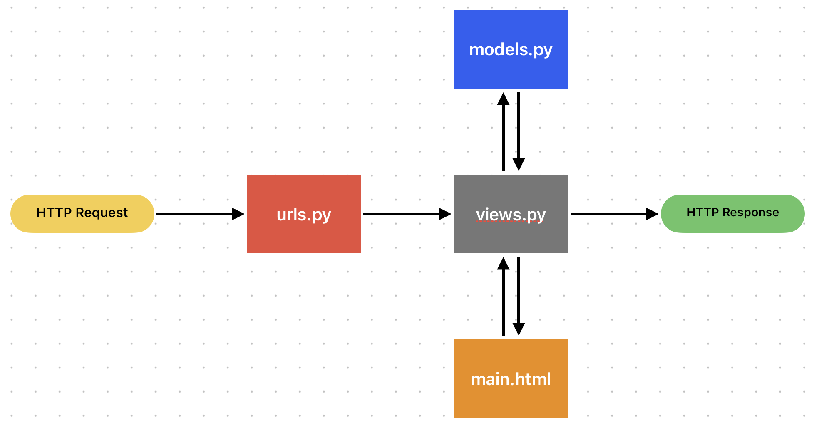
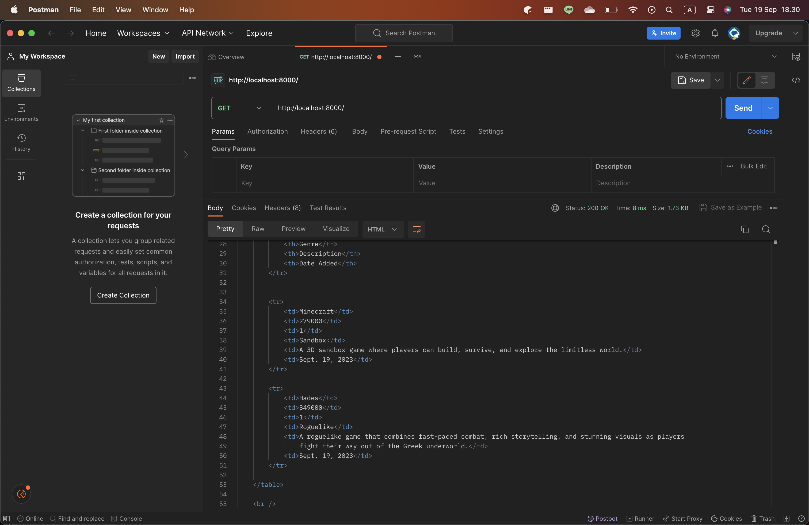
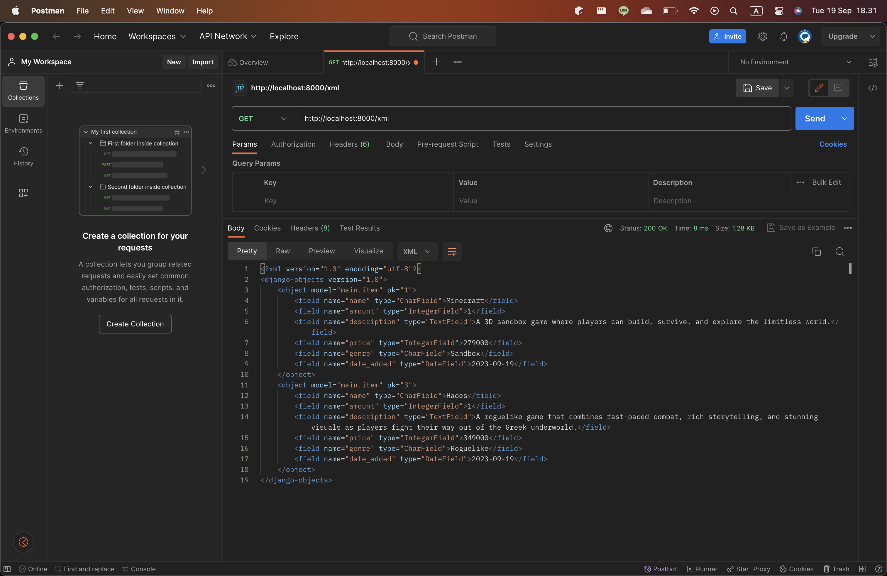
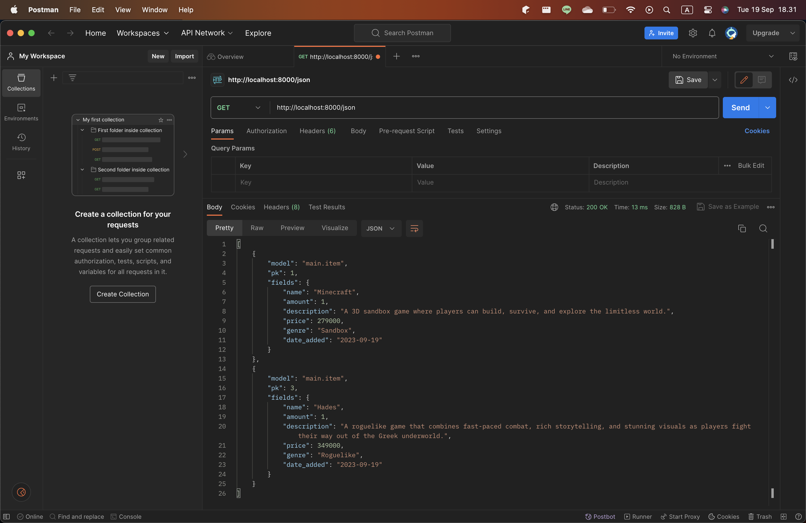
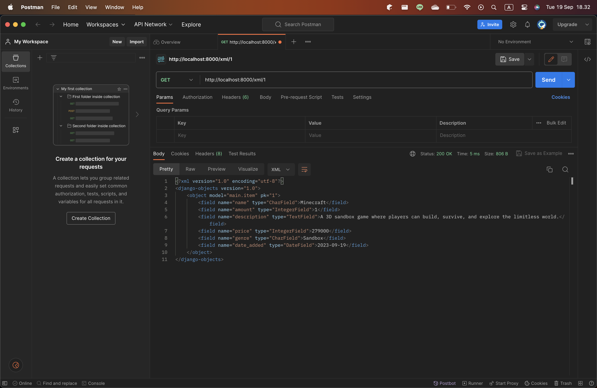
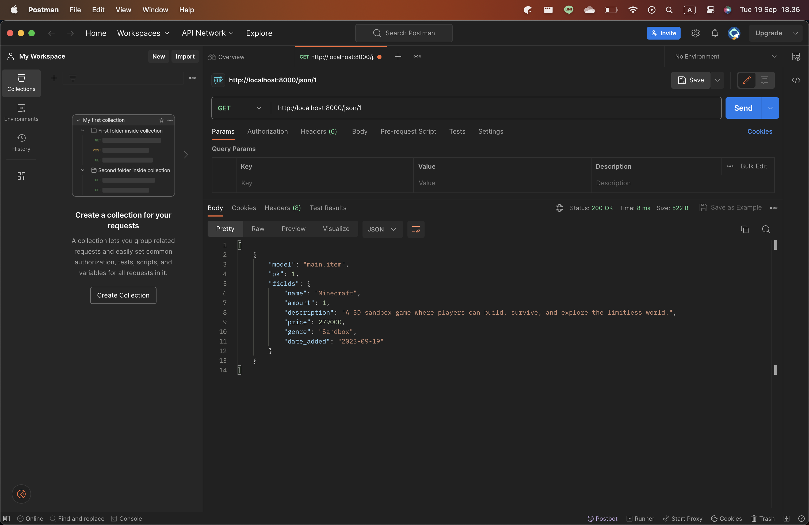

# Game Locker 🎮
#### Tautan aplikasi: https://game-locker.adaptable.app/main/

## Section
- [Tugas 2](#tugas-2)
    - [Pertanyaan 1: Implementasi](#jelaskan-bagaimana-cara-kamu-mengimplementasikan-checklist-di-atas-secara-step-by-step-bukan-hanya-sekadar-mengikuti-tutorial)
    - [Pertanyaan 2: Bagan Django](#buatlah-bagan-yang-berisi-request-client-ke-web-aplikasi-berbasis-django-beserta-responnya-dan-jelaskan-pada-bagan-tersebut-kaitan-antara-urlspy-viewspy-modelspy-dan-berkas-html)
    - [Pertanyaan 3: Mengapa menggunakan *virtual environment*](#jelaskan-mengapa-kita-menggunakan-virtual-environment-apakah-kita-tetap-dapat-membuat-aplikasi-web-berbasis-django-tanpa-menggunakan-virtual-environment)
    - [Pertanyaan 4: Penjelasan dan perbedaan MVC, MVT, MVVM](#jelaskan-apakah-itu-mvc-mvt-mvvm-dan-perbedaan-dari-ketiganya)
- [Tugas 3]()
    - [Pertanyaan 1: Perbedaan form POST dan form GET](#apa-perbedaan-antara-form-post-dan-form-get-dalam-django)
    - [Pertanyaan 2: Perbedaan XML, JSON dan HTML dalam pengiriman data](#apa-perbedaan-utama-antara-xml-json-dan-html-dalam-konteks-pengiriman-data)
    - [Pertanyaan 3: Mengapa JSON sering digunakan dalam pertukaran data](#mengapa-json-sering-digunakan-dalam-pertukaran-data-antara-aplikasi-web-modern)
    - [Pertanyaan 4: Implementasi](#jelaskan-bagaimana-cara-kamu-mengimplementasikan-checklist-di-atas-secara-step-by-step-bukan-hanya-sekadar-mengikuti-tutorial-1)
    - [Pertanyaan 5: Mengakses kelima URL dengan Postman](#mengakses-kelima-url-menggunakan-postman)
## Tugas 2: Implementasi *Model-View-Template* (MVT) pada Django
### Jelaskan bagaimana cara kamu mengimplementasikan *checklist* di atas secara step-by-step (bukan hanya sekadar mengikuti tutorial).
### Checklist 1: Membuat sebuah proyek Django baru
1. Membuat direktori baru untuk proyek ini dengan nama `game_locker`.
1. Membuka terminal dan pindah ke direktori tersebut.
1. Membuat berkas `requirements.txt` yang berisikan beberapa *dependencies* sebagai berikut.
    ```
    django
    gunicorn
    whitenoise
    psycopg2-binary
    requests
    urllib3
    ```
1. Membuat *virtual environment* dengan menjalankan perintah `python -m venv env`
1. Mengaktifkan *virtual environment* dengan perintah `source env/bin/activate`
1. Menginstalasi *dependencies* di atas dengan perintah `pip install -r requirements.txt`
1. Membuat projek Django baru dengan nama `game_locker` melalui perintah `django-admin startproject game_locker .`
1. Menambahkan `*` pada `ALLOWED_HOSTS` di `settings.py` untuk keperluan deployment.
    ```
    ...
    ALLOWED_HOSTS = ["*"]
    ...
    ```
1. Tambahkan juga berkas `.gitignore` sebelum melakukn *add*, *commit*, dan *push*. Untuk berkas `.gitignore` yang digunakan dalam proyek ini mengikuti template [berikut](https://pbp-fasilkom-ui.github.io/ganjil-2024/docs/tutorial-0#tutorial-unggah-proyek-ke-repositori-github).

### Checklist 2: Membuat aplikasi `main` pada proyek tersebut
1. Menjalankan perintah ini untuk membuat aplikasi baru bernama main `main`:
    ```
    python manage.py startapp main
    ```
1. Tambahkan aplikasi main ke dalam proyek:
    - Buka berkas `settings.py` di dalam direktori proyek `game_locker`.
    - Temukan variabel `INSTALLED_APPS`.
    - Daftarkan `main` ke dalam daftar aplikasi yang ada:
        ```
        INSTALLED_APPS = [
            ...,
            'main',
            ...
        ]
        ```

### Checklist 3: Melakukan *routing* pada proyek agar dapat menjalankan aplikasi `main`
#### * Dilakukan nanti bersamaan dengan *routing* pada `urls.py` aplikasi `main`.
1. Bukalah berkas `urls.py` di dalam direktori `game_locker` dan isi berkas dengan kode berikut.
    ```
    ...
    from django.urls import path, include

    urlpatterns = [
        ...
        path('main/', include('main.urls')),
        ...
    ]
    ```

### Checklist 4: Membuat model pada aplikasi `main` dengan nama *Item* dan memiliki atribut wajib *name*, *amount*, *description*
1. Membuka berkas `models.py` di dalam direktori `main`.
1. Mengisi `models.py` dengan kode berikut.
    ```
    from django.db import models

    class Item(models.Model):
        name = models.CharField(max_length=255) 
        amount = models.IntegerField()
        description = models.TextField()
        price = models.IntegerField()
        genre = models.CharField(max_length=30)
        date_added = models.DateField(auto_now_add=True)
    ```
1. Menjalankan perintah `python manage.py makemigrations` untuk membuat migrasi model. Berkas migrasi yang berisi perubahan model belum diaplikasikan ke dalam basis data.
1. Menjalankan perintah `python manage.py migrate` untuk menerapkan migrasi ke dalam basis data lokal.

### Checklist 5: Membuat sebuah fungsi pada views.py untuk dikembalikan ke dalam sebuah template HTML yang menampilkan nama aplikasi serta nama dan kelas kamu
1. Membuat direktori bernama `templates` di dalam direktori `main`
1. Membuat berkas `main.html` di dalam direktori `templates` dan diisi dengan teks berikut.
    ```
    <h1>Game Locker</h1>
    <p>Name: {{ name }}</p>
    <p>Class: {{ class }}</p>
    ```
1. Membuka berkas `views.py` di dalam direktori `main` dan isi dengan kode berikut.
    ```
    from django.shortcuts import render

    def show_main(request):
        context = {
            'name': 'Fikri Risyad Indratno',
            'class': 'PBP C'
        }
    
        return render(request, "main.html", context)
    ```

### Checklist 6: Membuat sebuah *routing* pada `urls.py` aplikasi `main` untuk memetakan fungsi yang telah dibuat pada `views.py`.
1. Membuat berkas `urls.py` di dalam direktori `main`.
2. Mengisi `urls.py` dengan kode berikut.
    ```
    from django.urls import path
    from main.views import show_main

    app_name = 'main'

    urlpatterns = [
        path('', show_main, name='show_main'),
    ]
    ```
### Checklist 7: Melakukan deployment ke Adaptable terhadap aplikasi yang sudah dibuat
1. *Login* ke Adaptable menggunakan akun GitHub.
1. Klik `New App` dan pilih *Connect an Existing Repository*.
1. Klik repositori proyek ini, yaitu `fikririsyad/game-locker` dan pilih *branch* main.
1. Pilih `Python App Template` sebagai *deploy template*.
1. Pilih `PostgreSQL` sebagai *Database Type*.
1. Pilih versi Python yang dipakai dalam proyek ini, yaitu `3.11` dan masukkan `python manage.py migrate && gunicorn game_locker.wsgi` pada bagian `Start Command`.
1. Masukkan nama aplikasi.
1. Centang bagian `HTTP Listener on PORT` dan klik `Deploy App` untuk memulai proses `deployment` aplikasi.

## Buatlah bagan yang berisi *request client* ke web aplikasi berbasis Django beserta responnya dan jelaskan pada bagan tersebut kaitan antara `urls.py`, `views.py`, `models.py`, dan berkas `html`.

### Penjelasan
1. *User* mengirimkan HTTP *Request* ke aplikasi Django.
2. Oleh `urls.py`, *request* tersebut akan diteruskan ke `views.py` yang sesuai.
3. `views.py` akan menggunakan `models.py` jika perlu mengakses data dari *database*.
4. Setelah selesai memproses *request*, `views.py` akan me-*render* HTML *template*.
5. HTML yang sudah ter-*render* kemudian akan dikembalikan ke *user* sebagai HTTP *response*.

## Jelaskan mengapa kita menggunakan ***virtual environment***? Apakah kita tetap dapat membuat aplikasi web berbasis Django tanpa menggunakan ***virtual environment***?
*Virtual environment* dibutuhkan dalam pembuatan aplikasi web berbasis Django untuk mengisolasi Python dan *dependencies* yang diperlukan. Dengan menggunakan *virtual environment*, Python dan *dependencies* yang kita perlukan tidak tercampur dengan Python dan *packages* dari *base environment*. Kita sebenarnya bisa saja membuat aplikasi web Django tanpa menggunakan *virtual environment*. Akan tetapi, agar lebih mudah mengelola Python dan *dependencies*-nya, lebih baik tetap menggunakan *virtual environment*.

## Jelaskan apakah itu MVC, MVT, MVVM dan perbedaan dari ketiganya.
### Penjelasan
1. MVC atau *Model*-*View*-*Controller*:

    - ***Model***</br>
        Komponen *Model* berfungsi untuk membuat logika data aplikasi dan mengelola datanya. 
    - ***View***</br>
        Komponen *View* berisikan logika dan struktur tampilan data yang akan dilihat.
    - ***Controller***</br>
        Komponen *Controller* berfungsi untuk menangani *request* dan memberikan *response*. *Controller* bertindak sebagai penghubung antara *Model* dan *View*. Menentukan View apa yang akan di-*render*.

1. MVT atau *Model*-*View*-*Template*:

    - ***Model***</br>
        Komponen *Model* berfungsi untuk membuat logika data aplikasi dan mengelola datanya.
    - ***View***</br>
        Komponen *View* berfungsi untuk menangani *request* dan memberikan *response*.
    - ***Template***</br>
        Komponen *Template* mendefinisikan struktur HTML yang nantinya akan di-*render*.

1. MVVM atau *Model*-*View*-*ViewModel*:

    - ***Model***</br>
        Komponen *Model* berfungsi untuk membuat logika data aplikasi dan mengelola datanya.
    - ***View***</br>
        Komponen *View* berkaitan dengan struktur dan tampilan data yang akan dilihat. *View* berinteraksi dengan *ViewModel* melalui *data binding*.
    - ***ViewModel***</br>
        Komponen *ViewModel* bertindak sebagai penghubung antara *Model* dan *View*. *ViewModel* berisikan logika utama bisnis.

### Perbedaan
- Perbedaan utama antara MVC dan MVT adalah pada MVC kita harus membuat semua kode untuk kontrol. Pada MVT, bagian *controller* sudah ditangani oleh *framework*.
- Perbedaan utama antara MVC dan MVVM adalah pada MVVM, *View* dapat berinteraksi langsung dengan propertinya di *ViewModel* menggunakan *data binding*.

## Tugas 3: Implementasi Form dan Data Delivery pada Django
### Apa perbedaan antara form `POST` dan form `GET` dalam Django?
1. `POST`
    - Akan mengumpulkan data dan meng-*encode* data tersebut untuk dikirimkan ke *server*.
    - Lebih aman untuk melindungi data karena tidak akan diekspos di URL.
    - Digunakan untuk *request* yang mengubah keadaan sistem, seperti *request* untuk melakukan perubahan di *database*.
    - `POST` *request* bersifat tidak idempoten, yang artinya mengirimkan *request* berulang kali akan memengaruhi *server*.
1. `GET`
    - Akan mengumpulkan data menjadi sebuah *string* kemudian *string* tersebut digunakan untuk membuat URL bersama dengan nilai-nilainya.
    - Lebih tidak aman karena akan mengekspos data di URL.
    - Digunakan untuk *request* yang tidak mengubah keadaan sistem, seperti formulir pencarian web.
    - `GET` *request* bersifat idempoten, yang artinya mengirimkan *request* berulang kali tidak akan memengaruhi *server*.
### Apa perbedaan utama antara XML, JSON, dan HTML dalam konteks pengiriman data?
1. XML
    - Format berkas untuk menyimpan dan mengirim data.
    - Lebih kompleks dan kurang fleksibel.
    - Ukuran berkas lebih besar dari JSON sehingga pengiriman data lebih lambat.
1. JSON
    - Format berkas untuk menyimpan dan mengirim data.
    - Lebih simpel dan lebih fleksibel.
    - Ukuran berkas lebih kecil dari XML sehingga pengiriman data lebih cepat
1. HTML
    - Format berkas untuk membuat struktur dan tampilan konten web.
### Mengapa JSON sering digunakan dalam pertukaran data antara aplikasi web modern?
Alasan utama JSON sering digunakan adalah karena ukuran berkas yang kecil dan pertukaran data yang sangat cepat. Selain itu, JSON memiliki format yang simpel, lebih mudah untuk dibaca, serta lebih mudah untuk di-*parsing* jika dibandingkan dengan XML.

### Jelaskan bagaimana cara kamu mengimplementasikan *checklist* di atas secara *step-by-step* (bukan hanya sekadar mengikuti tutorial).
### Checklist 1: Membuat input `form` untuk menambahkan objek model pada app sebelumnya.
1. Membuat kerangka `views` dengan cara membuat direktori baru bernama `templates` pada direktori *root*.
1. Membuat berkas `base.html` sebagai *template* dasar dan diisi dengan kode berikut:
    ```
    
    <!DOCTYPE html>
    <html lang="en">
        <head>
            <meta charset="UTF-8" />
            <meta
                name="viewport"
                content="width=device-width, initial-scale=1.0"
            />
            
            
        </head>

        <body>
            
            
        </body>
    </html>
    ```
1. Menambahkan kode berikut ke `settings.py` di dalam direktori `game_locker` agar *templates* di atas dapat terdeteksi:
    ```
    ...
    TEMPLATES = [
        {
            'BACKEND': 'django.template.backends.django.DjangoTemplates',
            'DIRS': [BASE_DIR / 'templates'], # Tambahkan kode ini
            'APP_DIRS': True,
            ...
        }
    ]
    ...
    ```
1. Membuat berkas `forms.py` di dalam direktori `main` dan mengisi berkas tersebut dengan kode berikut:
    ```
    from django.forms import ModelForm
    from main.models import Item

    class ItemForm(ModelForm):
        class Meta:
            model = Item
            fields = ["name", "price", "amount", "genre", "description"]
    ``` 
1. Membuka berkas `views.py` pada direktori `main` dan menambahkan fungsi `create_item` untuk menghasilkan formulir.
    ```
    from django.http import HttpResponseRedirect
    from django.urls import reverse
    from main.forms import ItemForm
    ...
    def create_item(request):
    form = ItemForm(request.POST or None)

    if form.is_valid() and request.method == "POST":
        form.save()
        return HttpResponseRedirect(reverse('main:show_main'))

    context = {'form': form}
    return render(request, "create_item.html", context)
    ```
1. Menambahkan *path* URL ke dalam `urls.py` pada direktori `main` dengan kode berikut:
    ```
    from main.views import show_main, create_item
    ...
    urlpatterns = [
        ...
        path('create-item', create_item, name='create_item'),
    ]
    ```
1. Membuat direktori `templates` pada direktori *root* dan menambahkan berkas `base.html` yang akan menjadi *template* HTML untuk berkas HTML lainnya. Isi berkas dengan kode berikut:
    ```
    
    <!DOCTYPE html>
    <html lang="en">
        <head>
            <meta charset="UTF-8" />
            <meta
                name="viewport"
                content="width=device-width, initial-scale=1.0"
            />
            
            
        </head>

        <body>
            
            
        </body>
    </html>
    ```
1. Menambahkan kode berikut di dalam berkas `settings.py` pada direktori `game_locker` agar *templates* di atas dapat terdeteksi.
    ```
    ...
    TEMPLATES = [
        {
            'BACKEND': 'django.template.backends.django.DjangoTemplates',
            'DIRS': [BASE_DIR / 'templates'], # Tambahkan kode ini
            'APP_DIRS': True,
            ...
        }
    ]
    ...
    ```
1. Mengubah berkas `main.html` pada direktori `main/templates` untuk bisa menggunakan *templates* di atas serta untuk menampilkan objek yang nantinya akan di-*submit* melalui formulir.
    ```
    

    
        <h1>Game Locker</h1>

        <h5>Name:</h5>
        <p>{{name}}</p>

        <h5>Class:</h5>
        <p>{{class}}</p>
        <table>
            <tr>
                <th>Name</th>
                <th>Price</th>
                <th>Amount</th>
                <th>Genre</th>
                <th>Description</th>
                <th>Date Added</th>
            </tr>

            
                <tr>
                    <td>{{item.name}}</td>
                    <td>{{item.price}}</td>
                    <td>{{item.amount}}</td>
                    <td>{{item.genre}}</td>
                    <td>{{item.description}}</td>
                    <td>{{item.date_added}}</td>
                </tr>
            
        </table>

        <br />

        <a href="">
            <button>
                Add New Item
            </button>
        </a>
    
    ```
1. Membuat berkas `create_item.html` pada direktori `main/templates` sebagai halaman untuk men-*submit* formulir dengan isi sebagai berikut:
    ```
     

    
    <h1>Add New Item</h1>

    <form method="POST">
        
        <table>
            {{ form.as_table }}
            <tr>
                <td></td>
                <td>
                    <input type="submit" value="Add Item"/>
                </td>
            </tr>
        </table>
    </form>

    
    ```
### Checklist 2: Tambahkan 5 fungsi `views` untuk melihat objek yang sudah ditambahkan dalam format HTML, XML, JSON, XML *by ID*, dan JSON *by ID*.
#### Format HTML
Membuka kembali berkas `views.py` pada direktori `main` dan mengubah fungsi `show_main` menjadi sebagai berikut untuk menampilkan semua objek `Item` pada halaman utama.
```
from main.models import Item
...
def show_main(request):
items = Item.objects.all()

context = {
    'name': 'Fikri Risyad Indratno',
    'class': 'PBP C',
    'items': items
}

return render(request, "main.html", context)
```

#### Format XML
Menambahkan fungsi `show_xml` untuk menampilkan data-data dalam format XML dengan kode berikut:
```
from django.http import HttpResponse
from django.core import serializers
...
def show_xml(request):
data = Item.objects.all()
return HttpResponse(serializers.serialize("xml", data), content_type="application/xml")
```

#### Format JSON
Menambahkan fungsi `show_json` untuk menampilkan data-data dalam format JSON dengan kode berikut:
```
def show_json(request):
data = Item.objects.all()
return HttpResponse(serializers.serialize("json", data), content_type="application/json")
```

#### Format XML *by ID*
Menambahkan fungsi `show_xml_by_id` untuk menampilkan data yang dipilih berdasarkan `id` dalam format XML dengan kode berikut:
```
def show_xml_by_id(request, id):
data = Item.objects.filter(pk=id)
return HttpResponse(serializers.serialize("xml", data), content_type="application/xml")
```

#### Format JSON *by ID*
Menambahkan fungsi `show_json_by_id` untuk menampilkan data yang dipilih berdasarkan `id` dalam format JSON dengan kode berikut:
```
def show_json_by_id(request, id):
data = Item.objects.filter(pk=id)
return HttpResponse(serializers.serialize("json", data), content_type="application/json")
```

### Checklist 3: Membuat routing URL untuk masing-masing `views` yang telah ditambahkan pada poin 2.
Membuka berkas `urls.py` pada direktori `main` dan menambahkan kode berikut:
```
from main.views import show_main, create_item, show_xml, show_json, show_xml_by_id, show_json_by_id
...
urlpatterns = [
    ...
    path('create-item', create_item, name='create_item'),
    path('xml/', show_xml, name='show_xml'), 
    path('json/', show_json, name='show_json'),
    path('xml/<int:id>/', show_xml_by_id, name='show_xml_by_id'),
    path('json/<int:id>/', show_json_by_id, name='show_json_by_id'), 
]
```

### Mengakses kelima URL menggunakan Postman.
#### Format HTML

#### Format XML

#### Format JSON

#### Format XML *by ID*

#### Format JSON *by ID*
